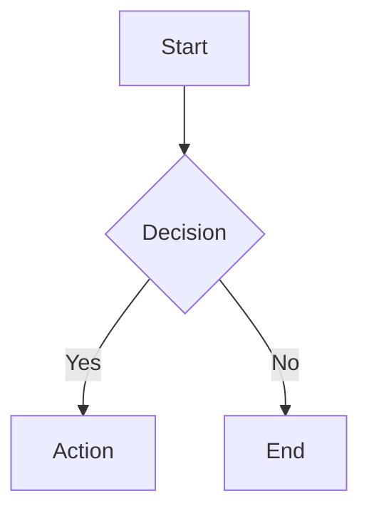

# Tufte Markdown Preview

A VS Code extension that replaces the default markdown preview with elegant, Tufte-inspired typography and Mermaid diagram support.

## Features

- Warm sepia tones with proper serif typography (Cormorant Garamond)
- IBM Plex Mono for code blocks (falls back to JetBrains Mono, SF Mono, Consolas)
- Gradient heading underlines, book-style paragraph indentation
- Custom styled lists, blockquotes, tables, and code blocks
- Automatically adapts to VS Code light/dark theme
- Mermaid diagram rendering with matching Tufte theme

Inspired by [Tufte CSS](https://edwardtufte.github.io/tufte-css/), [Conductor](https://conductor.app/), and [Typora](https://typora.io/).

## Mermaid Diagrams

Render diagrams directly in your markdown preview:

~~~markdown

~~~

Supports all Mermaid diagram types: flowchart, sequence, class, state, ER, gantt, pie, git graph, mindmap, architecture, timeline, and more.

### Mermaid Configuration

| Setting | Default | Description |
|---------|---------|-------------|
| `tufte-markdown-preview.mermaid.lightTheme` | `tufte` | Theme for light mode (`tufte`, `default`, `neutral`, `forest`) |
| `tufte-markdown-preview.mermaid.darkTheme` | `tufte` | Theme for dark mode (`tufte`, `dark`, `neutral`, `forest`) |
| `tufte-markdown-preview.mermaid.maxTextSize` | `50000` | Max characters per diagram |
| `tufte-markdown-preview.mermaid.securityLevel` | `strict` | Security level (`strict`, `loose`, `antiscript`, `sandbox`) |

### Editor Syntax Highlighting

For syntax highlighting of Mermaid code blocks in the editor (not preview), install [Mermaid Markdown Syntax Highlighting](https://marketplace.visualstudio.com/items?itemName=bpruitt-goddard.mermaid-markdown-syntax-highlighting).

## Install

### From VSIX

1. Download the latest `.vsix` from [Releases](https://github.com/nicobailon/tufte-markdown-preview/releases)
2. Run:
```bash
code --install-extension tufte-markdown-preview-*.vsix
```

### From Source

```bash
git clone https://github.com/nicobailon/tufte-markdown-preview
cd tufte-markdown-preview
npm install
npm run build
npx @vscode/vsce package
code --install-extension tufte-markdown-preview-*.vsix
```

## Usage

Open any markdown file and use `Cmd+Shift+V` (Mac) or `Ctrl+Shift+V` (Windows/Linux) to open the preview.

## License

MIT
