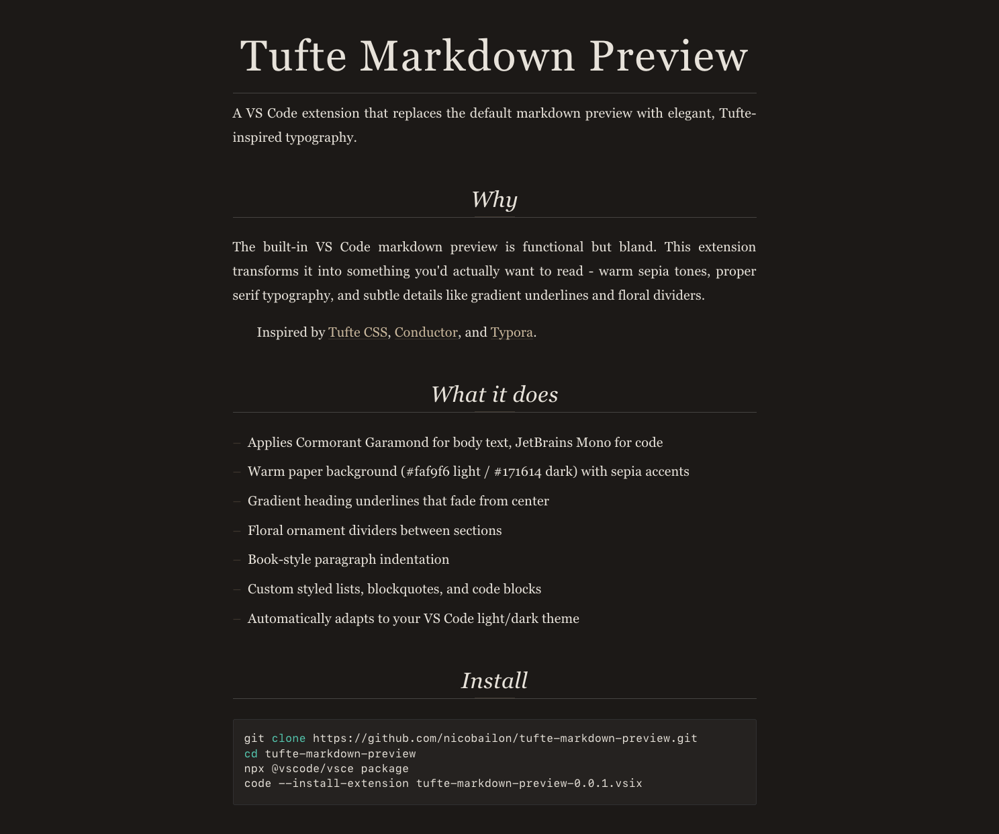

# Tufte Markdown Preview

A VS Code extension that replaces the default markdown preview with elegant, Tufte-inspired typography.



## Why

The built-in VS Code markdown preview is functional but bland. This extension transforms it into something you'd actually want to read - warm sepia tones, proper serif typography, and subtle details like gradient underlines and floral dividers.

Inspired by [Tufte CSS](https://edwardtufte.github.io/tufte-css/), [Conductor](https://conductor.app/), and [Typora](https://typora.io/).

## What it does

- Applies Cormorant Garamond for body text, JetBrains Mono for code
- Warm paper background (#faf9f6 light / #171614 dark) with sepia accents
- Gradient heading underlines that fade from center
- Floral ornament dividers between sections
- Book-style paragraph indentation
- Custom styled lists, blockquotes, and code blocks
- Automatically adapts to your VS Code light/dark theme

## Install

1. Download the latest `.vsix` from [Releases](https://github.com/nicobailon/tufte-markdown-preview/releases)
2. Run:
```bash
code --install-extension tufte-markdown-preview-*.vsix
```

## Usage

Open any markdown file and use `Cmd+Shift+V` (Mac) or `Ctrl+Shift+V` (Windows/Linux) to open the preview.

## License

MIT
