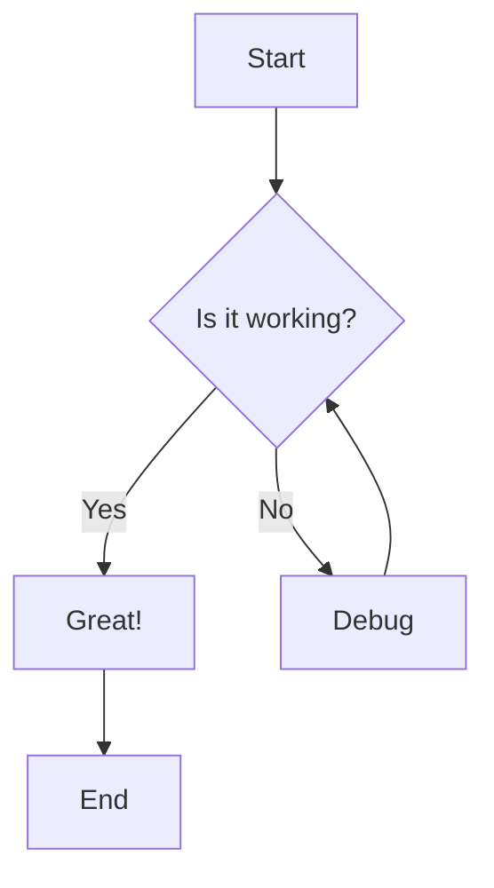
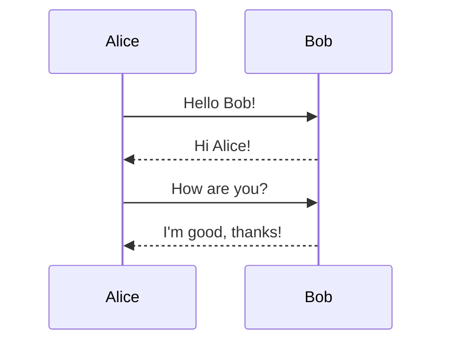
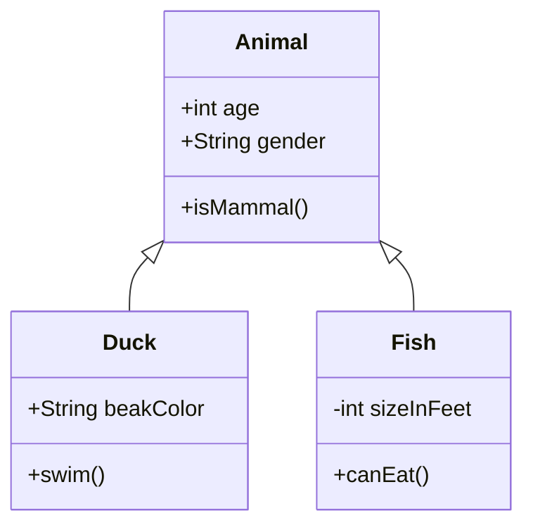

# Mermaid Test

## Flowchart

```mermaid
flowchart TD
    A[Start] --> B{Is it working?}
    B -->|Yes| C[Great!]
    B -->|No| D[Debug]
    D --> B
    C --> E[End]
```

## Sequence Diagram

```mermaid
sequenceDiagram
    participant Alice
    participant Bob
    Alice->>Bob: Hello Bob!
    Bob-->>Alice: Hi Alice!
    Alice->>Bob: How are you?
    Bob-->>Alice: I'm good, thanks!
```

## Class Diagram

```mermaid
classDiagram
    Animal <|-- Duck
    Animal <|-- Fish
    Animal : +int age
    Animal : +String gender
    Animal: +isMammal()
    Duck : +String beakColor
    Duck : +swim()
    Fish : -int sizeInFeet
    Fish : +canEat()
```

## Error Test

```mermaid
this is invalid mermaid syntax
```
